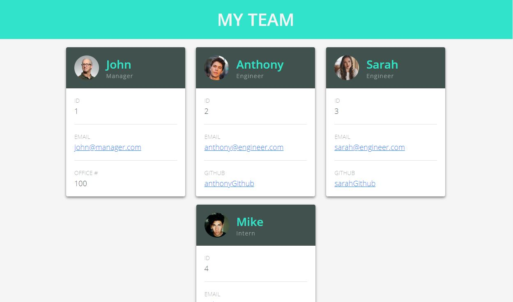
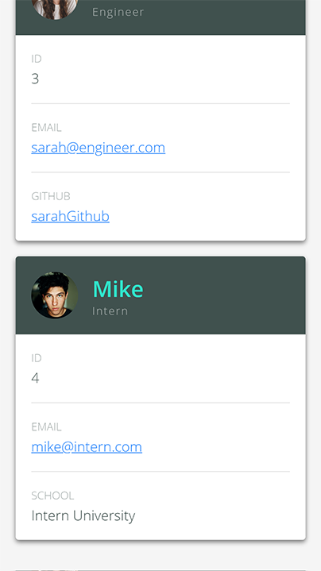

# 10 Team Profile Generator
> Command-line interface application for dynamically generating a team profile html

This was a homework assignment, where we built a Node CLI that takes in information about employees and generates an HTML webpage that displays summaries for each person. Since testing is a key piece in making code maintainable, we also ensured that all unit tests pass. This software engineering team generator command line application will prompt the user for information about the team manager and then information about the team members. The user can input any number of team members, and they may be a mix of engineers and interns. When the user has completed building the team, the application will create an HTML file that displays a nicely formatted team roster based on the information provided by the user.

## Completed
* Ensure all unit tests pass
* Use the `inquirer npm package` to prompt the user for their email, id, and specific information based on their role with the company
* App will run as a Node CLI to gather information about each employee.
* Install all dependencies: `jest` for running the provided tests, and `inquirer` for collecting the input from the user
* Build all necessary classes:
   * `Employee`
   * `Manager`
   * `Engineer`
   * `Intern`
* Follow this workflow:
   1. Run tests
   2. Create or update classes to pass a single test case
   3. Repeat
* Create multiple HTML templates for each type of user:
   * `main.html`
   * `engineer.html`
   * `intern.html`
   * `manager.html`
* The different employee types should all inherit some methods and properties from a base class of `Employee`.
* Generate a `team.html` page in the `output` directory, that displays a nicely formatted team roster. Each team member should display the following in no particular order:
   * Name
   * Role
   * ID
   * Role-specific property (Office number, link to GitHub profile, or school)

## User Story

```
As a manager
I want to generate a webpage that displays my team's basic info
so that I have quick access to emails and GitHub profiles
```

## Screenshots
  


## Animate GIF
